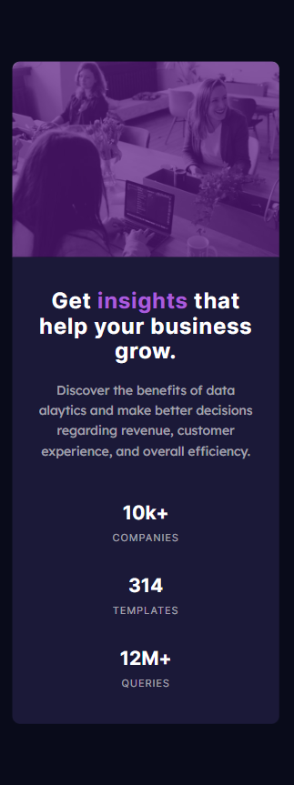

# Frontend Mentor - Product preview card component solution

This is a solution to the [Product preview card component challenge on Frontend Mentor](https://www.frontendmentor.io/challenges/product-preview-card-component-GO7UmttRfa). Frontend Mentor challenges help you improve your coding skills by building realistic projects.

## Table of contents

- [Overview](#overview)
  - [The challenge](#the-challenge)
  - [Screenshot](#screenshot)
  - [Links](#links)
- [My process](#my-process)
  - [Built with](#built-with)
  - [What I learned](#what-i-learned)
  - [Useful resources](#useful-resources)
- [Author](#author)

## Overview

### The challenge

Users should be able to:

- View the optimal layout depending on their device's screen size
- See hover and focus states for interactive elements

### Screenshot

### Mobile

### Dektop

### Links

- Solution URL: [https://github.com/Cleshy/Card-Component](https://github.com/Cleshy/Card-Component)
- Live Site URL: [https://admirable-medovik-49ee7e.netlify.app/](https://admirable-medovik-49ee7e.netlify.app/)

## My process

### Built with

- Semantic HTML5 markup
- CSS custom properties
- Flexbox
- CSS Grid

### What I learned

These are really great exercises, and I hope my solutions will be good as well. 🤞

### Useful resources

- [CSS Grid](https://css-tricks.com/snippets/css/complete-guide-grid/)
- [CSS Flexbox](https://css-tricks.com/snippets/css/a-guide-to-flexbox/)
- [CSS em & rem by Kevin Powell](https://www.youtube.com/watch?v=_-aDOAMmDHI&ab_channel=KevinPowell)

## Author

- Frontend Mentor - [@Cleshy](https://www.frontendmentor.io/profile/Cleshy)
